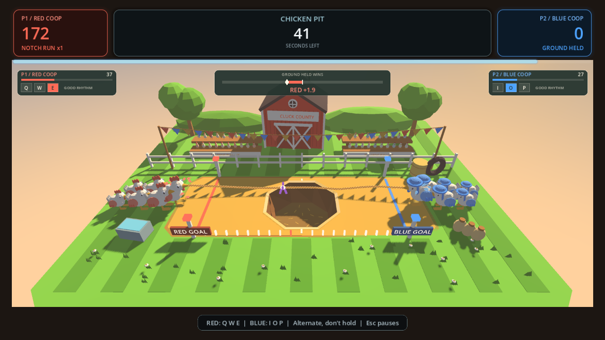

# Chicken Pit

A barnyard tug-of-war for two coops. Roll your pull keys to drag the rope
your way; strength drains between pulls, so a steady rhythm beats one wild
burst. Two coops. One rope. Absolutely no dignity.



This repository is a **game folder for the DeskCanSaw Godot base project**. It
is consumed as a git submodule at `godot-base/games/chicken_pit/` inside
[`jraleman/dcs_games`](https://github.com/jraleman/dcs_games).
On its own it is
not a runnable project — there is no `project.godot` here, because the base
project owns the engine configuration, the autoloads and every shared screen.

## The game

**Cluck County's Great Pull-Off** is a real 3D toy-farm diorama: a
cross-braced red barn, mown grass, bunting, bleachers full of chickens, and
six rigid-part birds per coop. Red wears tall combs; blue wears tied bonnets.
The knot travels along a sagging rope, birds brace and flap with each accepted
pull, and a pin sends the losing coop tumbling into a real, straw-lined hole
in the middle of the arena. The birds skid, teeter at the lip, kick and flap
through a staggered somersault, then bounce into the bedding. The rope ripples
with each pull and shortens with the falling flock, carrying its knot over
the rim and down into the hole instead of floating above the field.

An automatic camera sweeps through front-quarter angles, heights and zoom
levels. It starts with the full arena, then pushes into tighter action
close-ups as a coop loses ground. Rear chickens and distant scenery can leave
the frame, but both lead birds, the rope action and the hole stay visible.
Recovering ground smoothly restores the wide shot. During a pin, the camera
arcs toward the front of the hole and follows the falling flock instead of
pulling back to fit the spectators.
Golden light slowly deepens into a peach-and-mauve sunset, with cool fill so
both coops stay readable. Camera attention follows the current tug, not the
banked score; neither camera nor lighting changes the match rules.

The pit remembers your completed matches: **six chickens per match, capped at
24**, are already waiting when you return. Your first game starts with an
empty hole. Replays, CPU games and Lives matches all share the same saved
flock; quitting, restarting and individual lives exchanges do not count as
completed games. Players with the existing first-match achievement start with
one remembered match. The flock is decorative and never changes scoring.
Its residents gently bob and peck while the match is in progress.

The new art and audio are authored here: vertex-painted meshes, rope and feather
textures, an original plucked county-fair jig, and a small sound bank.
As either coop approaches a pin, beat-matched percussion, bass and extra
plucks build the music's intensity, then ease back when the danger passes.
The soundtrack follows the Music volume/mute controls, pauses with the game,
and stops on results or any menu exit. Replays restart one soundtrack; Lives
exchanges keep the tune in time while releasing the danger layer.
No model downloads, Blender installation, or asset-store account are needed.
The warm, dark standalone menus open onto a colourful sunset-lit farm.
The main menu wears an original square cover: two rival chickens pulling in
front of Cluck County's barn, framed in cream and gold. It is a staged 3D
render of the game's models, not a stock photograph or a HUD screenshot.
The shareable scorecard uses that same full-colour farm portrait, gold and
cream lettering, and a frozen fairground backdrop. Both coops' scores appear
alongside pulls, notches taken and the best notch run, with the shared
achievement panel and scannable stats QR code intact.

**Timer** rounds default to 45 seconds. Bank 20 points per notch-second of
ground held, plus 100 for each new deepest notch. A pin guarantees the winner
a 2,000-point lead and ends the round after a short celebration. At the buzzer,
the higher score wins, not whichever side happened to win the last exchange.

**Lives** rounds have no clock: each pin costs the other coop one life, then
the rope re-centres. The first coop to exhaust the other's pool wins. Scores
and match history survive the resets.

Play two humans on one keyboard, or choose a CPU opponent. **Chick** gives
ground when overwhelmed; **Hen** adjusts its effort and takes breathers;
**Rooster** punishes pauses. All three use the same pull gates as a human.
Choose the named bird in *Settings → Game*; the unrelated target-style CPU
difficulty picker stays hidden. The pit always has two ends, so mode selection
skips the single/multiplayer question entirely and opens on *who plays as
Player 2* — this game clears the base's `supports_single_player` capability.
Framework single-player entry points still seat a bird, even where the shared
shell only displays the human's score card.

The shared base still owns pause, results, stats, sharing, achievements and
settings. This game requires the base's generic `CONTROL_STYLE_CUSTOM_KEYS`
trait so its own keys and CPU opponent are both offered.
The scorecard also uses the base's opt-in `GameTheme.style_share_card`
branding and custom stat-caption support; it does not replace the shared card.

[`DESIGN.md`](DESIGN.md) records the mechanics and architecture;
[`AGENTS.md`](AGENTS.md) records implementation conventions and maintenance commands.

## Layout

```
DESIGN.md / AGENTS.md       # design decisions and implementation guidance
game.gd                    # GameManifest — how the framework discovers this game
gameplay.gd / .tscn        # inherited scene of scenes/game/game_shell.tscn
chicken_pit_options.gd     # constants-only tunables + control bindings
intro.gd / .tscn           # narrated opening, standalone builds only
pit/pit_state.gd           # pure, deterministic pulling, scoring and pin rules
pit/pit_history.gd         # completed-match persistence and the 24-chicken cap
pit/cpu_bird.gd            # seeded target-strength opponents
pit/pit.tscn / pit_view.gd  # isolated 3D world, pooled effects, crowd
pit/toy_mesh.gd            # shared vertex-painted geometry builder
pit/scenery.gd             # original barn, fairground and dressing
pit/chicken_rig.gd         # single-surface, rigid-part chicken models
pit/chicken.gdshader       # wings, head and feet without extra draw calls
pit/pit_camera.gd          # automatic shots, losing-coop zoom and safe framing
pit/pit_lighting.gd        # scene-owned sunset cycle and accessible light accents
pit/pit_music.gd           # owned, synchronized jig and near-pin danger stem
pit/sunset_sky.gdshader    # painted gradient sky, driven by the scene's clock
pit/rope_view.gd           # refitting cosmetic rope, beak grips and pit-rim supports
ui/tug_meter.gd            # native-resolution strength, knot and rebound key hints
ui/menu_background.gdshader # original approach-to-the-fairground menu backdrop
ui/menu_*.tres             # standalone menu backdrop, plaque, widget skin, sounds
ui/share_art.gd / .tscn    # original cover portrait in the shared scorecard
assets/                    # icon, narration, original textures and WAV audio
assets/ui/plaque.svg       # barn-board texture for the standalone menu plaque
assets/menu-cover.png      # full-colour 1536-square standalone menu cover
tools/render_cover.gd      # reproducible offline cover photography
tools/render_audio.py      # reproducible offline sound-bank authoring
tests/                     # model, options, intro, camera/audio and round/render coverage
```

## Running it

Rebuild the menu cover from this game folder with a graphics display:

```powershell
godot --path ..\.. --script res://games/chicken_pit/tools/render_cover.gd -- --game=all
godot --headless --path ..\.. --import
```

Commit the generated `assets/menu-cover.png` with its source. The cover uses
fixed poses and a dedicated viewport; it does not run a round or change saved
settings.

The *How to play* screen's walkthrough clip is recorded by the base project's
shared pipeline, not from this folder, and lands outside it:

```powershell
cd ..\..
.\tools\record_tutorials.ps1 -Games chicken_pit -Godot (Get-Command godot).Source
```

That drives a real round with a scripted puller rotating `Q`/`W`/`E` at a legal
cadence, then writes `assets/video/tutorial_chicken_pit.ogv` and its poster,
which `game.gd` points at. `assets/pit-poster.png` stays the still above.

Clone the base project with its submodules, then run from `godot-base/`:

```powershell
git clone --recurse-submodules git@github.com:jraleman/dcs_games.git
cd dcs_games\godot-base

godot --headless --path . --import
godot --path . -- --game=chicken_pit   # standalone build: own intro, own theme
godot --path . -- --game=all           # the collection
```

Tests are standalone headless scripts and must exit 0. Run the suite with
`--game=all`; several tests assert values this game's manifest declares:

```powershell
godot --headless --path . --import
godot --headless --path . --script res://games/chicken_pit/tests/pit_state_test.gd -- --game=all
godot --headless --path . --script res://games/chicken_pit/tests/pit_matrix_test.gd -- --game=all
godot --headless --path . --script res://games/chicken_pit/tests/pit_geometry_test.gd -- --game=all
godot --headless --path . --script res://games/chicken_pit/tests/pit_camera_test.gd -- --game=all
godot --headless --audio-driver Dummy --path . --script res://games/chicken_pit/tests/pit_audio_test.gd -- --game=all
godot --headless --path . --script res://games/chicken_pit/tests/pit_round_test.gd -- --game=all
godot --headless --path . --script res://games/chicken_pit/tests/chicken_pit_options_test.gd -- --game=all
godot --headless --path . --script res://games/chicken_pit/tests/chicken_pit_intro_test.gd -- --game=all
```

The presentation check needs an actual graphics window; it exercises both
coops, all rope-length extremes, automatic shots and visible losing-coop zoom,
sunset lighting, live accessibility, and the under-60-draw-call budget,
including shadows:

```powershell
godot --path . --resolution 1280x720 --script res://games/chicken_pit/tests/pit_view_test.gd -- --game=all
```

The framework-wide tests in `godot-base/tests/` cover this game automatically —
`game_shell_test.gd`, `game_options_test.gd`, `game_select_test.gd` and
`single_game_test.gd` all iterate the catalog, so there is no per-game copy.

## Controls

Two three-key clusters, far enough apart that two people can share one
keyboard. Three keys per coop rather than one, because a tug-of-war is won by
alternating fingers — a single held key would reward an autofire pad instead of
the player.

| Coop | Default keys |
| --- | --- |
| Red (P1) | `Q` `W` `E` |
| Blue (P2) | `I` `O` `P` |

Both clusters are rebindable in *Settings → Controls*. `Esc` pauses.

Holding a key only pulls once. A coop can accept at most ten pulls per second;
a same-frame chord is still one pull. Repeating the same key earns only 35%
of an alternating pull. Aim for a comfortable rolling rhythm, not maximum
keyboard noise. The tug meter shows current strength and names the leading
coop without relying on colour.

## Options

*Settings → Game* renders one row per tunable declared in
`chicken_pit_options.gd`:

| Option | Default | Range |
| --- | --- | --- |
| Round length | 45 s | 15–90 s |
| Rope length | 10 notches | 6–18 |
| Pull power | 100% | 50–200% |
| Strength decay | 100% | 50–200% |
| CPU opponent | Hen | Chick · Hen · Rooster |

The CPU is a named bird rather than a number because it changes *how* it
plays, not just how hard it pulls.

## Accessibility

Rebindable pull keys for both coops, audio captions for meaningful sound-only
events, reduced motion, player labels that never rely on colour alone, and the
intro narration transcribed on screen so the opening is never sound-only.

Reduced motion fixes the camera and sunset lighting, straightens the rope and
removes decorative motion and particles; essential knot movement and strength
remain visible.
Pinned chickens appear in the hole immediately instead of tumbling, with the
same flock count and round timing. The rope still fits the landed birds and
bends over the rim, but without waves; the resident flock's idle motion also stops.
Intense effects can be disabled independently, including pull shake and
tension-driven light accents. Pause and results freeze camera and lighting;
Lives exchanges do not restart the sunset. Shared speed and extra-time
assists apply from the next round, as do this game's tunables.

**Platform scope: desktop keyboard play.** The rendering remains compatible
with the base's GL Compatibility renderer, but this game does not claim touch
or gamepad input.

## Authoring the assets

Models are source geometry in `pit/`, not opaque imports. The static farm is
batched into one coloured mesh; each chicken's tagged rigid parts share one
surface and a vertex shader. Spectators and notch posts use `MultiMesh`.
Contact comes from the directional shadow; heavyweight SSAO and glow are
deliberately unnecessary for the matte toy look. The central opening cuts
through every ground layer, with recessed walls and straw bedding. Its resident
chickens share one fixed-size `MultiMesh`, not individual nodes or physics
bodies, so returning players add at most one draw call.

The checked-in WAV files are ordinary game assets, not runtime synthesis.
Rebuild them with Python's standard library, from this game folder:

```powershell
python tools\render_audio.py
```

## Credits

- **Game design & code** — DeskCanSaw
- **Opening narration** — "The chicken pit" story, a clip from *Painkiller
  Already*, transcribed on screen
- **Music** — "The Great Pull-Off", an original county-fair jig, DeskCanSaw
- **Sound** — original offline-authored clucks, creak, crowd and pin cues
- **Models & textures** — original vertex-painted toy farm, rigid-part
  chickens, rope, feathers and dust, authored in this repository

The old scaffold's CGTrader, Freesound and Kevin MacLeod credits referred to
assets that were not present. Those assets are not used by this implementation.

## Licence

MIT — see [LICENSE](LICENSE) — for the code and original game assets.
The pre-existing opening narration retains its original ownership; the code
licence does not grant rights to that recording.
